# CampQuest United States
This is my first full stack CRUD project that allows users to view, post, edit, delete, and leave reviews on the campgrounds. 
  
<b>Features that I added/will be added on top of Colt Steele's Web Development Bootcamp: </b>
 

1.**[NPS API](https://www.nps.gov/subjects/developer/guides.htm)** - I integrated real campgrounds in the United States using an API. 
2. **☀️light and 🌙dark mode** - I used JS DOM Manipulation, localStorage, and Cookies to implement this themed feature. 
3. **🌳My campgrounds** - This feature allows users to show the campgrounds they uploaded to YelpCamp!  
4. **📄pagination feature** - I also used DOM Manipulation, cookies, and Mongoose to implement pagination. This augments the performance by loading only few datas the user wants rather than loading a whole single resource. 
5. 🔍**Filter Campgrounds Feature** - allows users to look for campgrounds located on a certain state.

## 🔨Stacks
CampQuest is built with **MEN** (*Mongo, Express, and Node*) stack.

## 👀 Previews
#### Login
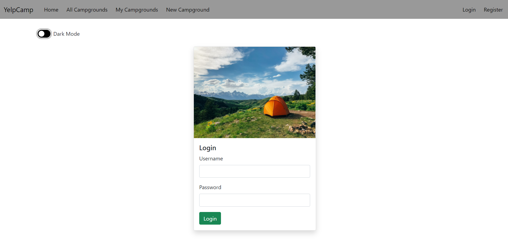

#### Login (dark mode)
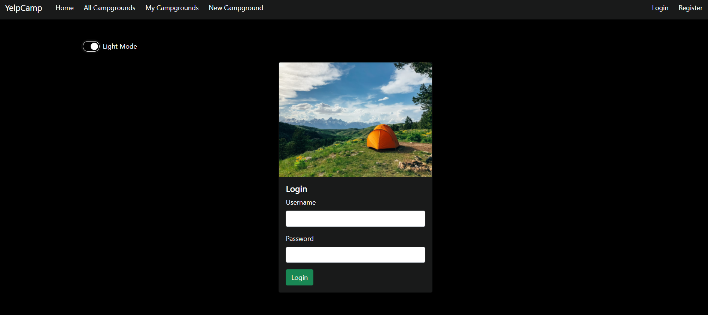

#### Register
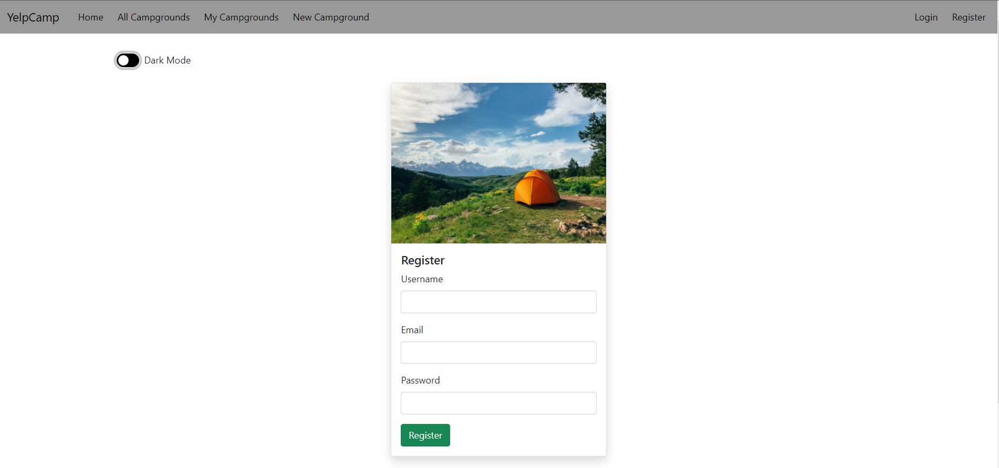

#### Register (dark mode)
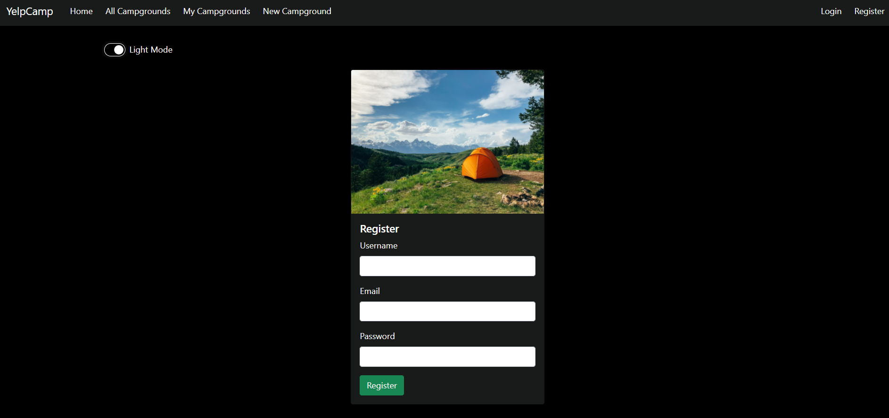

#### Homepage
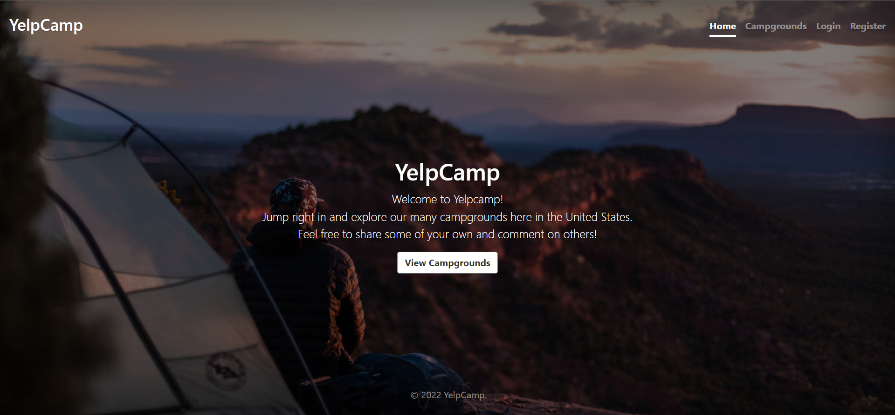

#### All Campgrounds
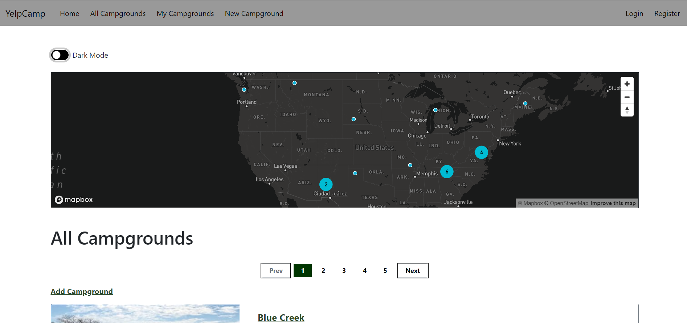

#### All Campgrounds
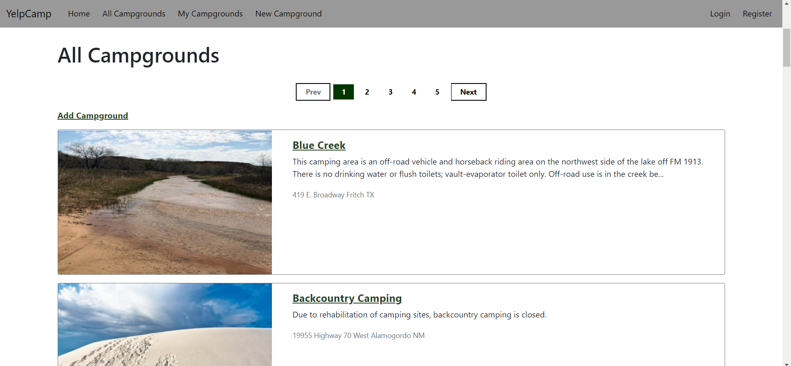

#### All Campgrounds (dark mode)
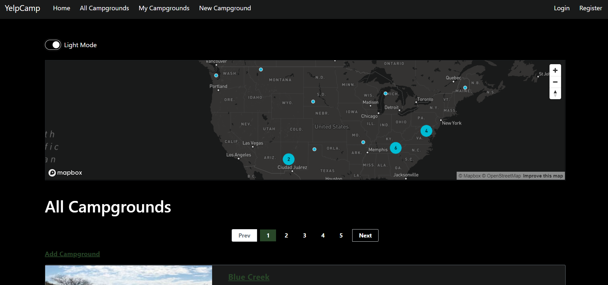

#### All Campgrounds (dark mode)
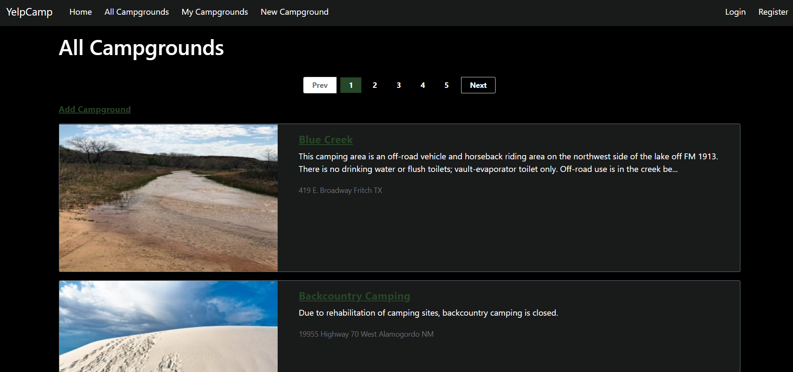

#### Show a Campground
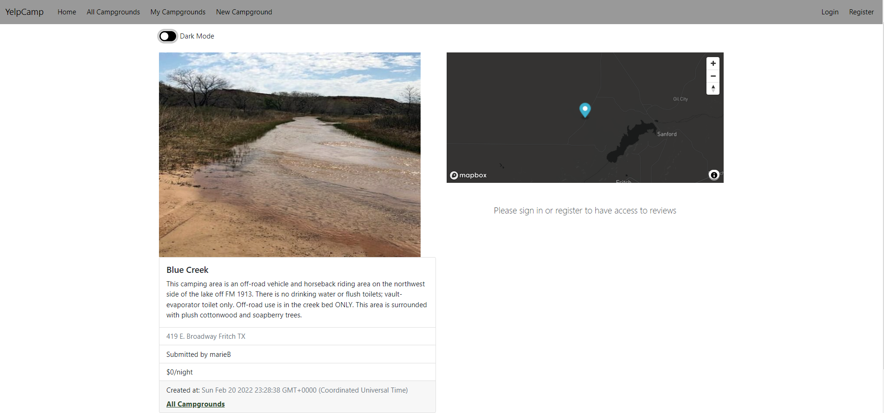

#### Show a Campground (dark mode)
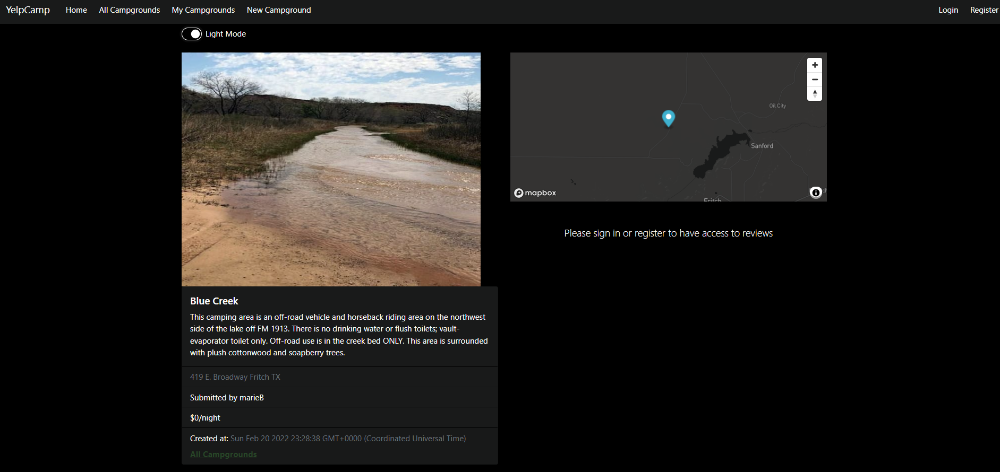

#### Edit a Campground
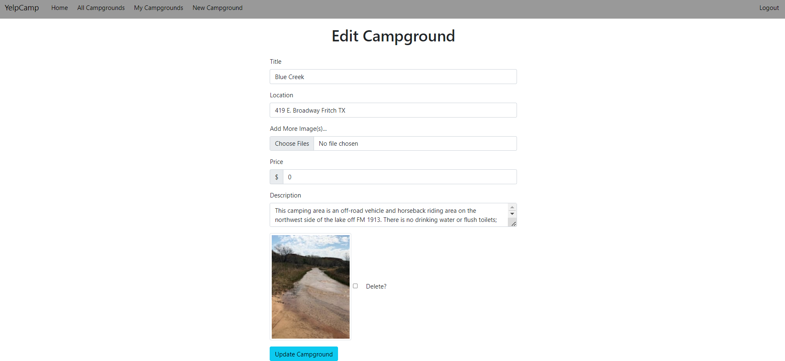

#### Reviews
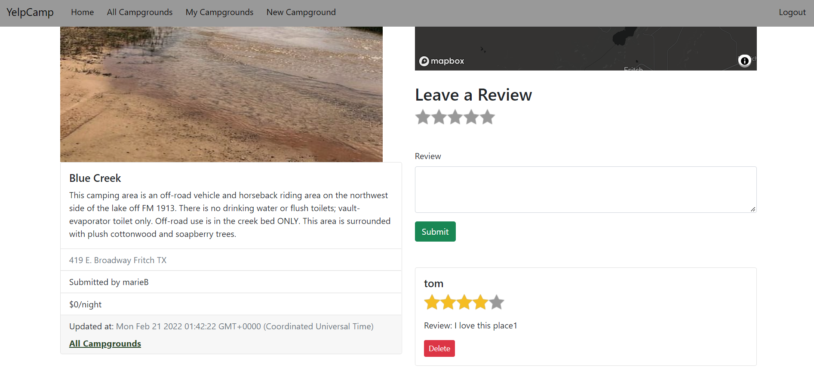

## 🧰Tools

### 
1.  #### Mongoose
2.  #### MapBox
3.  #### Coudinary
4.  #### Passport.js
5.  #### Embedded Javascript
6.  #### Axios
7.  #### Joi

